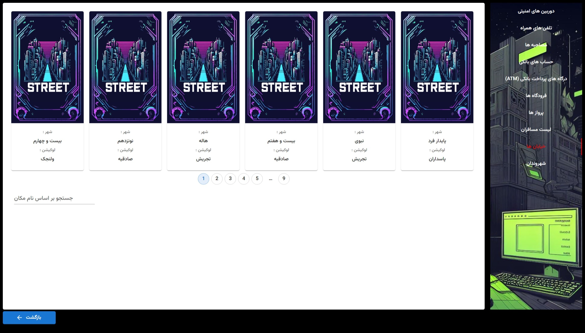

# Getting Started with Create React App

This project was bootstrapped with [Create React App](https://github.com/facebook/create-react-app).

## Available Scripts

In the project directory, you can run:

### `npm start`

Runs the app in the development mode.\
Open [http://localhost:3000](http://localhost:3000) to view it in your browser.

The page will reload when you make changes.\
You may also see any lint errors in the console.

## Story
A murder happened on 10/19/2023 in Velenjek
You are in the role of a police officer who is entrusted with the mission of identifying the identity of the killer
The narration of the story of the game happened in the city of Tehran. There are different parts in this city that contain information that is stored in the municipal database.
You should identify the identity of the persons related to them with the information you get from these centers (for example, which person does the license plate number or phone number found belong to?) and by putting the information together and finding the person who is in all of them. Identify the identity of the killer

## Project Snapshots

